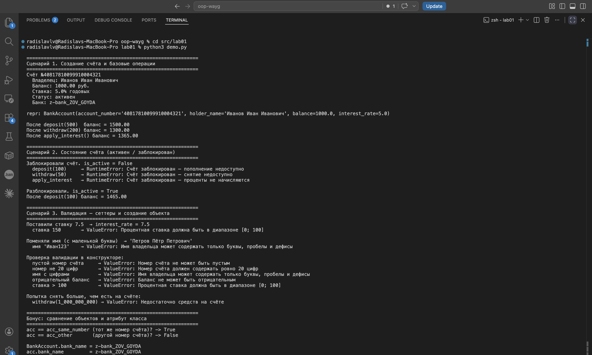

# ЛР-1 — Класс и инкапсуляция

**Вариант:** №4 — банковская система. Сделал класс `BankAccount`.

## Что в папке

- `model.py` — сам класс
- `validate.py` — функции-проверки в одном месте, чтоб не копипастить
- `demo.py` — гоняем класс по сценариям
- `README.md` — этот файл

## Как запускать

```
cd src/lab01
python3 demo.py
```

## Почему BankAccount

Из вариантов (`BankAccount`, `Transaction`, `Client`, `Credit`, `Deposit`)
взял счёт — у него и атрибуты понятные, и ограничения сами просятся
(баланс ≥ 0, ставка 0–100, номер ровно 20 цифр), и состояние есть
(активен/заблокирован), и сравнивать просто — по номеру счёта.

## Ответы на 5 вопросов с практики

**1. Сущность.** Банковский счёт — реальный объект: номер, владелец,
баланс, ставка. Не действие, а именно объект.

**2. Атрибуты.** `_account_number`, `_holder_name`, `_balance`,
`_interest_rate`, `_is_active` — всё закрытое, наружу через свойства.
Плюс атрибут класса `bank_name` — он один на всех.

**3. Инварианты.** Номер — 20 цифр. ФИО — буквы + пробелы/дефисы.
Баланс ≥ 0. Ставка 0–100. Снять можно не больше, чем лежит. На
заблокированном счёте денежные операции запрещены. Все проверки —
в `validate.py`, чтоб не дублировались.

**4. Равенство.** Два счёта равны, если совпал номер. Имя/баланс/ставка
могут быть какими угодно — это всё равно один и тот же счёт.

**5. Состояние.** `активен` ↔ `заблокирован`, переключаем через
`activate()` / `deactivate()`. На заблокированном `deposit`/`withdraw`/
`apply_interest` кидают `RuntimeError`.

## Что реализовано

На 3: класс, 5 закрытых атрибутов, конструктор с проверкой,
`@property`-геттеры, `__str__`, `__eq__`, бизнес-метод `deposit`.

На 4: `__repr__`, сеттеры с валидацией (`holder_name`, `interest_rate`),
атрибут класса `bank_name`, методы `withdraw` и `apply_interest`,
форматирование через `f-string`, валидация и по типу, и по смыслу.

На 5: валидация вынесена в `validate.py` и не дублируется, есть смена
состояния (`activate`/`deactivate`), поведение зависит от состояния,
в `demo.py` три сценария + бонус.

## Что показывает `demo.py`

1. **Базовые операции** — создаём счёт, печатаем (`__str__`/`__repr__`),
   кладём, снимаем, начисляем проценты.
2. **Состояние** — блокируем, ловим `RuntimeError` на трёх операциях,
   разблокируем — снова работает.
3. **Валидация** — гоняем сеттеры и конструктор с битыми данными,
   плюс показываем, что `withdraw` не пускает в минус.
4. **Бонус** — сравнение по номеру и атрибут класса через класс и
   через экземпляр.

## Скриншот


