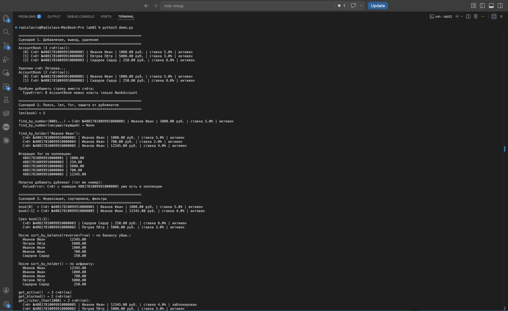

# ЛР-2 — Коллекция объектов

Контейнер для счетов из ЛР-1. Назвал `AccountBook` — типа тетрадка со счетами.

## Что в папке

- `model.py` — `BankAccount` из прошлой лабы
- `collection.py` — сам `AccountBook`
- `demo.py` — гоняем коллекцию по сценариям
- `README.md` — этот файл

## Запуск

```
cd src/lab02
python3 demo.py
```

## Что умеет AccountBook

**На 3:** хранит счета в списке, `add` проверяет, что суём
именно `BankAccount`, `remove` и `get_all` (отдаём копию, чтоб снаружи
наш `_items` не покорёжили).

**На 4:** `find_by_number` и `find_by_holder` для поиска, `__len__`
и `__iter__` чтоб можно было писать `len(book)` и `for acc in book`,
плюс защита от дублей — два счёта с одним номером не пройдут.

**На 5:** `__getitem__` (`book[0]`, срезы тоже работают),
`remove_at(index)`, сортировки `sort_by_balance` / `sort_by_holder` /
`sort_by_rate`, и фильтры (`get_active`, `get_blocked`,
`get_richer_than`), которые **возвращают новую коллекцию**, а не правят
исходник.

Бонусом — `__contains__` и `__hash__` (счета можно класть в `set`).

## Что в `demo.py`

1. Добавляем три счёта, выводим, удаляем один, пробуем подсунуть
   строку вместо счёта — ловим `TypeError`.
2. Кидаем ещё счетов, гоняем `len()`, поиск, итерацию, и пробуем
   добавить дубликат по номеру — ловим `ValueError`.
3. Тыкаем индексами (`book[0]`, `book[-1]`, срез `book[1:3]`),
   сортируем по разному, фильтруем — видно, что фильтр отдал новую
   коллекцию, а исходник как был, так и остался. В конце —
   `remove_at(0)`.

## Скриншот


