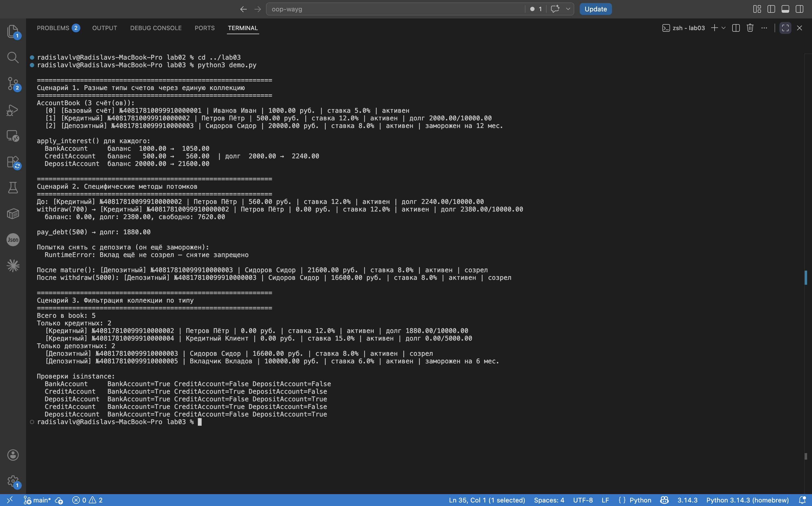

# ЛР-3 — Наследование

Базовый `BankAccount`, и от него два наследника — кредитный счёт и
вклад. Цель — не плодить копипасту, а добавлять только то, что
отличается.

## Иерархия

```
BankAccount         (base.py — базовый)
 ├── CreditAccount  (с лимитом и долгом)
 └── DepositAccount (с замороженным сроком)
```

## Что в папке

- `base.py` — `BankAccount`
- `models.py` — `CreditAccount`, `DepositAccount`
- `collection.py` — `AccountBook` с фильтрацией по типу
- `demo.py`, `README.md`

```
cd src/lab03
python3 demo.py
```

## Что наследники добавили

**CreditAccount.** Новые поля — `_credit_limit`, `_debt`. Новые
методы — `pay_debt(amount)` и свойство `available`. Переопределено:
`withdraw` теперь даёт уйти в долг до лимита; `apply_interest`
начисляет проценты на **долг** (банк начисляет тебе, а не наоборот);
`__str__` через `super()` добавляет инфу про долг.

**DepositAccount.** Новые поля — `_term_months`, `_is_matured`.
Метод `mature()` — открыть вклад, когда срок прошёл. `withdraw`
переопределён: пока не созрел — `RuntimeError`, после `mature()`
работает как обычный счёт через `super().withdraw()`.

Базовый `__str__` подхватывает атрибут класса `kind` — у каждого
наследника он свой (`"Кредитный"`, `"Депозитный"`), и в выводе
сразу видно, какой это счёт. Это и есть полиморфизм для атрибутов
класса.

## Коллекция

`AccountBook` ничего особо не правил — `isinstance(item, BankAccount)`
сам пропускает наследников. Добавил только два фильтра по типу:
`get_only_credit()` и `get_only_deposit()`.

## Что в `demo.py`

1. **Полиморфизм.** Кладём в одну коллекцию счета трёх разных типов
   и в одном цикле дёргаем `apply_interest()`. У каждого результат
   свой: у обычного и у вклада растёт баланс, у кредитного — долг.
   Никаких `if isinstance` в вызывающем коде.
2. **Спец-методы потомков.** У `CreditAccount` снимаем больше, чем
   есть на балансе — лишнее уходит в долг. Гасим часть через
   `pay_debt()`. У `DepositAccount` пробуем снять — `RuntimeError`,
   потом `mature()` — и всё работает.
3. **Фильтрация по типу.** `get_only_credit()` / `get_only_deposit()`
   и таблица `isinstance`-проверок: видно, что `CreditAccount` —
   это и `CreditAccount`, и `BankAccount` одновременно.

## Скриншот



## Что вынес из лабы

`super()` снимает дублирование — наследник не переписывает то, что
уже умеет родитель, а добавляет своё. Полиморфизм избавляет
вызывающий код от ветвления по типу — мы дёргаем один метод, а Python
сам выбирает, какую версию запустить.
