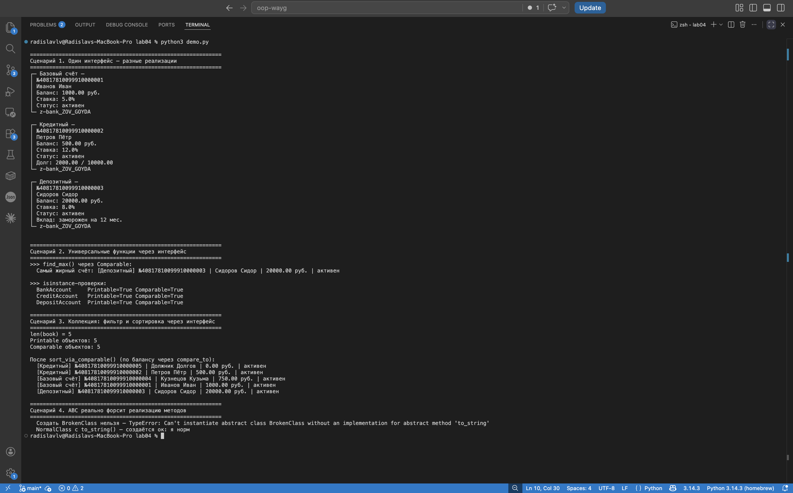

# ЛР-4 — Интерфейсы и абстрактные классы (ABC)

## 1. Цель работы

- Освоить абстрактные базовые классы (`abc.ABC`, `@abstractmethod`).
- Понять интерфейс как «контракт поведения».
- Закрепить полиморфизм через единый интерфейс — без `if isinstance(...)`
  в вызывающем коде.

## 2. Описание интерфейсов

Реализованы в `interfaces.py`:

### `Printable`

```python
class Printable(ABC):
    @abstractmethod
    def to_string(self) -> str: ...
```

Контракт: объект умеет красиво представить себя в виде строки.
Используется для отчётов, логов, вывода в коллекциях.

### `Comparable`

```python
class Comparable(ABC):
    @abstractmethod
    def compare_to(self, other) -> int: ...
```

Контракт: объект умеет сравниваться с другим объектом своего рода
по правилу `-1 / 0 / +1`. Используется для сортировки и поиска
максимума.

## 3. Реализация в классах

| Класс            | Printable | Comparable | Особенности                                                         |
| ---------------- | --------- | ---------- | ------------------------------------------------------------------- |
| `BankAccount`    | да        | да         | базовая реализация: красивая «рамка» в `to_string`, сравнение по балансу |
| `CreditAccount`  | да (через `super()`) | да (по балансу) | в `to_string()` добавляется строка про долг                |
| `DepositAccount` | да (через `super()`) | да (по балансу) | в `to_string()` добавляется состояние вклада               |

`CreditAccount` и `DepositAccount` сами `to_string` целиком не пишут —
они дёргают `super().to_string()` и вставляют свои строчки. Дублирования
кода нет.

Все три класса реализуют **сразу два интерфейса** (множественная
реализация — `class BankAccount(Printable, Comparable)`).

### Интеграция с коллекцией

`AccountBook` (`collection.py`):

- `get_printable()` — отбирает `Printable` объекты;
- `get_comparable()` — отбирает `Comparable`;
- `sort_via_comparable()` — сортировка через `compare_to` без явного `key=`;
- `print_all()` — печать всех через `to_string`.

Плюс универсальные функции в том же файле:

- `print_all(items)` — печатает любую коллекцию `Printable`-ов;
- `find_max(items)` — ищет максимум через `Comparable.compare_to`.

Эти функции **не знают про `BankAccount`** — работают через интерфейс.
Если завтра появится новый класс, реализующий те же интерфейсы,
функции с ним сразу заработают.

## 4. Демонстрация

В `demo.py` четыре сценария.

**Сценарий 1.** Три объекта разных типов через `to_string()` —
у каждого свой формат, но интерфейс один. Полиморфизм без `if`.

**Сценарий 2.** Функции `find_max(accounts)` и проверки `isinstance`
по интерфейсам. Видно, что один объект реализует оба контракта.

**Сценарий 3.** Коллекция `AccountBook`: фильтр по интерфейсу
(`get_printable`, `get_comparable`) и сортировка через
`sort_via_comparable()` — отсортировано по балансу, без указания
ключа сортировки извне.

**Сценарий 4.** ABC реально работает: класс, наследник `Printable`,
который забыл реализовать `to_string()`, не создаётся — Python кидает
`TypeError` уже при `__init__`. Это и есть смысл «контракта».


