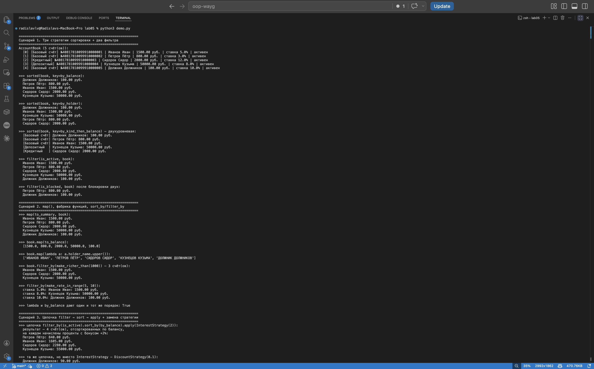

# ЛР-5 — Функции как аргументы. Стратегии и делегаты.

## 1. Цель работы

- Освоить передачу функций как аргументов.
- Применить `map`, `filter`, `sorted` с пользовательскими ключами.
- Реализовать паттерн «Стратегия» через функции и `callable`-объекты.
- Объединить функциональный стиль с ООП-кодом из ЛР-1, ЛР-2, ЛР-3.

## 2. Реализованные функции и стратегии

### Файл `strategies.py`

**Функции-ключи для сортировки:**

| Имя                       | Что делает                                       |
| ------------------------- | ------------------------------------------------ |
| `by_balance`              | сортировка по балансу                            |
| `by_holder`               | сортировка по ФИО владельца                      |
| `by_rate`                 | сортировка по процентной ставке                  |
| `by_kind_then_balance`    | двухуровневая: сначала по виду, потом по балансу |

**Функции-фильтры (предикаты):**

`is_active`, `is_blocked`, `is_credit`, `is_deposit` — простые булевы
функции для `filter()` и `filter_by()`.

**Фабрики функций (замыкания):**

| Имя                          | Параметр              |
| ---------------------------- | --------------------- |
| `make_richer_than(threshold)`| порог суммы           |
| `make_holder_filter(name)`   | конкретный владелец   |
| `make_rate_in_range(lo, hi)` | диапазон ставок       |

Каждая возвращает новую функцию, которая помнит свой параметр через
замыкание. Это позволяет настраивать фильтр снаружи без жёсткой зашивки.

**Преобразователи для `map`:**

`to_summary`, `to_balance`, `to_holder`.

**Callable-классы (стратегии с состоянием):**

- `DiscountStrategy(percent)` — режет баланс на заданный процент;
- `InterestStrategy(bonus_percent)` — начисляет проценты с бонусом.

Оба класса реализуют `__call__`, поэтому экземпляры вызываются как
функции: `cut = DiscountStrategy(0.1); cut(account)`.

### Файл `collection.py`

`AccountBook` расширен тремя стратегическими методами:

- `sort_by(key_func, reverse=False)` — сортирует через переданный ключ
  (in-place, возвращает `self`);
- `filter_by(predicate)` — возвращает **новую** коллекцию, прошедшую
  фильтр;
- `apply(func)` — применяет функцию к каждому элементу (in-place,
  возвращает `self`);
- `map(transform)` — возвращает список результатов (тип может меняться).

Все три метода возвращают коллекцию (или `self`), благодаря чему
работают цепочки:

```python
book.filter_by(is_active).sort_by(by_balance).apply(InterestStrategy(2))
```

## 3. Демонстрация работы

В `demo.py` три сценария.

**Сценарий 1.** Три стратегии сортировки и два фильтра. Показано, как
`sorted()` и `filter()` принимают функции как аргументы. Отдельно —
двухуровневая сортировка `by_kind_then_balance` через возврат кортежа.

**Сценарий 2.** `map()` и его эквивалент `book.map()`, фабрика функций
(`make_richer_than(1000)`, `make_rate_in_range(5, 10)`) и сравнение
именованной функции с лямбдой — порядок одинаковый, потому что они
делают одно и то же.

**Сценарий 3.** Полная цепочка `filter_by → sort_by → apply` с двумя
разными стратегиями (`InterestStrategy(2)` и `DiscountStrategy(0.1)`).
Один и тот же код коллекции даёт разный результат — это и есть
«взаимозаменяемая стратегия». В конце — `DiscountStrategy` вызывается
как функция (`__call__`).



## 4. Вывод

- Передача функций как аргументов делает коллекцию универсальной —
  одни и те же `sort_by`/`filter_by` работают с любыми правилами,
  потому что правила вынесены наружу.
- Фабрики функций (замыкания) удобны, когда правило зависит от
  параметра — мы не плодим десять `is_richer_than_100`,
  `is_richer_than_1000` и т.д., а делаем одну `make_richer_than`.
- `callable`-классы — это «функция со состоянием». Их можно
  настраивать в рантайме, у них есть `__repr__`, и они работают
  как обычные функции в любом месте, где ожидается функция.
- Цепочка операций даёт декларативный стиль: код описывает, что
  должно произойти, а не как.
