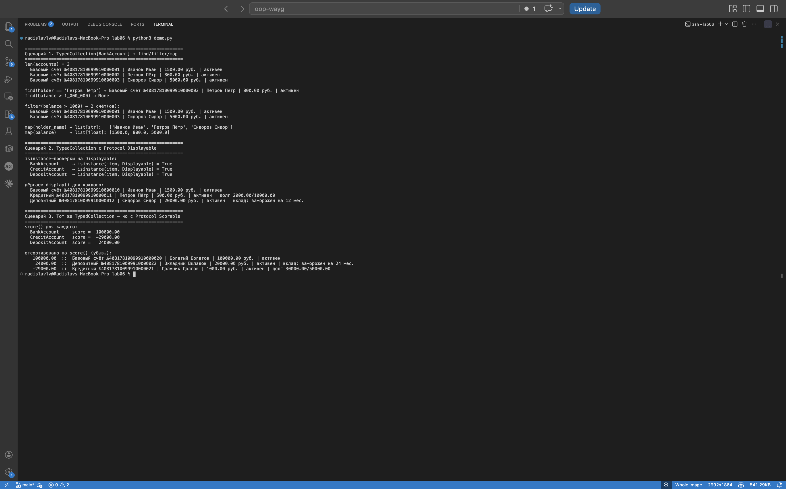

# ЛР-6 — Generics и Protocol

Здесь добавляем системе типизацию: классы аннотированы, коллекция
параметризуется типом, плюс делаем интерфейсы через `Protocol` —
без всякого наследования.

## Что в папке

- `model.py` — иерархия счетов с полными аннотациями типов
- `container.py` — `TypedCollection[T]` и два протокола (`Displayable`, `Scorable`)
- `demo.py`, `README.md`

```
cd src/lab06
python3 demo.py
```

## Аннотации типов

В `model.py` всё типизировано — параметры конструктора, возвращаемые
значения, поля в `__init__`. Например:

```python
def __init__(self, account_number: str, holder_name: str,
             balance: float = 0.0, interest_rate: float = 0.0) -> None:
    self._balance: float = _validate_money(balance, "Баланс")
```

Сам Python в рантайме типы не проверяет, но IDE и `mypy` их видят —
кода становится меньше шанс что-то напутать.

## TypedCollection[T]

```python
T = TypeVar("T")

class TypedCollection(Generic[T]):
    def __init__(self) -> None:
        self._items: list[T] = []
    def add(self, item: T) -> None: ...
```

Контейнер, который знает, что внутри. `TypedCollection[BankAccount]` —
коллекция конкретно `BankAccount`-ов. Если попытаться положить туда
строку — `mypy` ругнётся.

Помимо базовых методов (`add`, `remove`, `get_all`, `__iter__`,
`__getitem__`) есть `find`, `filter` и **`map`**:

```python
R = TypeVar("R")
def map(self, transform: Callable[[T], R]) -> list[R]: ...
```

Тут второй `TypeVar R` — потому что результат преобразования может
быть совсем другого типа. Из `TypedCollection[BankAccount]` через
`map(lambda a: a.holder_name)` получим `list[str]`, через
`map(lambda a: a.balance)` — `list[float]`.

## Protocol — интерфейс без наследования

```python
@runtime_checkable
class Displayable(Protocol):
    def display(self) -> str: ...

@runtime_checkable
class Scorable(Protocol):
    def score(self) -> float: ...
```

Классы `BankAccount` / `CreditAccount` / `DepositAccount` **не
наследуются** от этих протоколов. У них просто есть методы `display()`
и `score()`. Этого достаточно — `Protocol` проверяет совместимость
по форме объекта, а не по родословной (это и есть «утиная типизация»).

`@runtime_checkable` нужен, чтоб работала проверка
`isinstance(obj, Displayable)` в рантайме.

`score()` у каждого класса считается по-своему: у `BankAccount` —
просто баланс; у `CreditAccount` — `balance - debt` (может уйти в
минус); у `DepositAccount` — баланс плюс прогноз процентов.

## TypeVar с bound

```python
D = TypeVar("D", bound=Displayable)
```

«Какой угодно тип, лишь бы он был `Displayable`». Внутри
`TypedCollection[D]` можно смело дёргать `item.display()` — IDE и
`mypy` знают, что метод там есть.

## Что в `demo.py`

1. **`TypedCollection[BankAccount]`** — `find` (один раз нашли, один
   раз `None`), `filter` (отфильтрованный список), `map` дважды с
   разными функциями: получается `list[str]` и `list[float]`. Видно,
   зачем второй TypeVar.
2. **`TypedCollection[Displayable]`** — кладём туда счета разных
   типов. `isinstance(obj, Displayable) == True` для всех, хотя
   никто не наследовался. В цикле дёргаем `display()` — у каждого
   свой формат.
3. **`TypedCollection[Scorable]`** — тот же класс контейнера,
   но с другим протоколом. Сортируем по `score()` — у каждого
   класса своя метрика, поэтому порядок логичный.

## Скриншот



## Что вынес

`Generic[T] + TypeVar` дают переиспользуемый контейнер с
типобезопасностью. Второй `TypeVar` (`R`) нужен, когда тип результата
отличается от исходного. `Protocol` развязывает интерфейс от
наследования — достаточно иметь нужный метод. А связка
`TypeVar(bound=Protocol)` — самое мощное: generic-контейнер с
гарантией, что внутри лежат объекты с конкретными методами.
